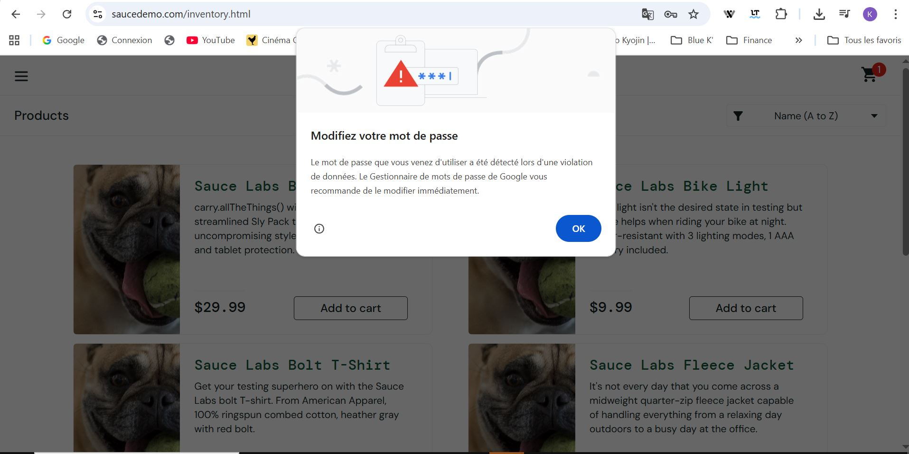
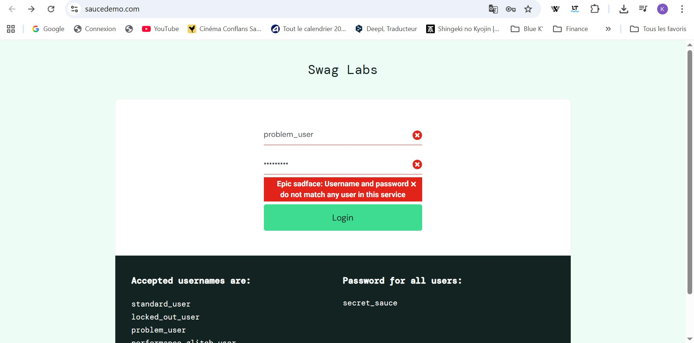

# 🧪 Projet QA – Test exploratoire & UX (SauceDemo)

## 🎯 Contexte

Ce projet consiste en une simulation de mission QA réalisée sur un site réel de démonstration e-commerce : https://www.saucedemo.com

L’objectif est de réaliser des tests exploratoires afin d’identifier des anomalies, incohérences et problèmes d’expérience utilisateur.

---

## 🎥 Démonstration vidéo

👉 Présentation du test exploratoire réalisé sur SauceDemo :  
(https://www.loom.com/share/d822112efc3f47c188486787e8e45802)

---

## 🧠 Méthodologie

- Test exploratoire
- Analyse UX (expérience utilisateur)
- Approche basée sur l’observation et l’investigation
- Organisation du travail inspirée des pratiques Agile (flux continu)

---

## 🧪 Périmètre

- Connexion utilisateur
- Navigation produits
- Ajout au panier
- Processus de commande (checkout)

---

## 📸 Exemples de tests réalisés

### 🔐 Test de connexion

---

### ❌ Test d’erreur de connexion

---

## 📋 Livrables

- Test charter (plan d’exploration)
- Notes d’exploration
- Bug reports détaillés
- Captures d’écran

---

## 🛠️ Outils

- Navigateur web
- GitHub
- Documentation Markdown

---

## 📊 Résultats

Les tests ont permis d’identifier plusieurs anomalies critiques et majeures :

- blocage du processus de commande (checkout)
- dysfonctionnements du panier
- incohérences visuelles
- problèmes de feedback utilisateur

Ces anomalies impactent directement l’expérience utilisateur et empêchent la finalisation d’une commande.

---

## 🔗 Site testé

https://www.saucedemo.com

---

## 💡 Démarche

Ce projet a été réalisé de manière autonome dans une logique de mise en pratique du test logiciel, en reproduisant une approche réaliste utilisée en environnement professionnel.

---

✨ Projet QA exploratoire basé sur un site réel – analyse, détection et documentation des anomalies
